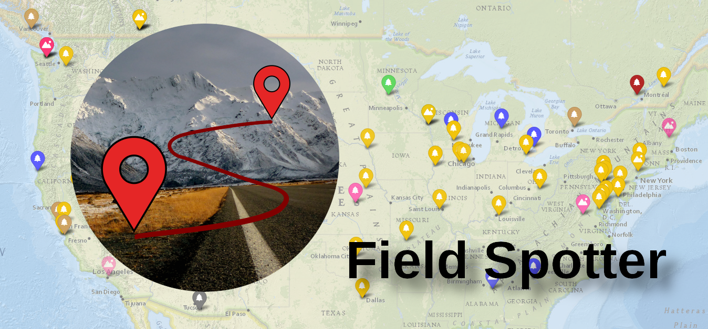

# Field Spotter

Field Spotter is a mobile-first progressive web app to display live Amateur Radio POTA & SOTA spots on a geographic map, and on a frequency band. Designed for use in the field to locate park-to-park and summit-to-summit opportunities in a more intuitive way than the POTA and SOTA websites' spot lists. It can of course also be used from home by POTA and SOTA chasers.

Use it at [https://fieldspotter.ianrenton.com](https://fieldspotter.ianrenton.com).

Read more about the project at [https://ianrenton.com/projects/field-spotter](https://ianrenton.com/projects/field-spotter).